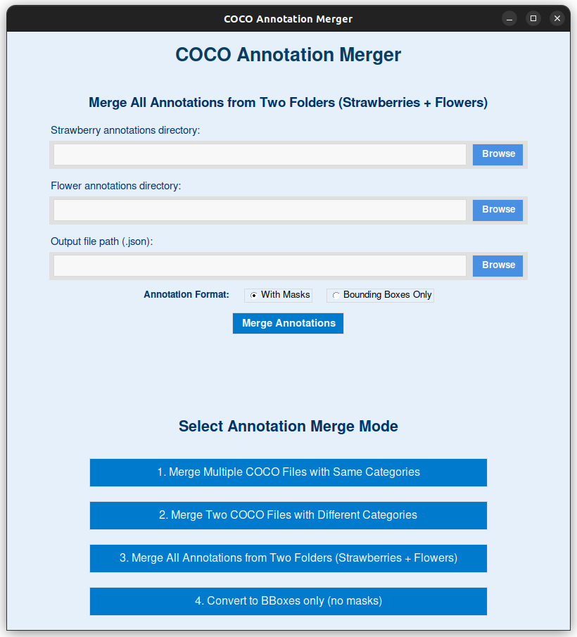

## 🧠 COCO Annotation Merger - GUI Tool

**Author:** Yael Vicente  
**Last Updated:** April 2025  
**License:** MIT  

---

## 🧾 Description

**COCO Annotation Merger** is a cross-platform desktop application that provides an intuitive graphical interface for merging COCO-format annotation files used in computer vision tasks such as object detection and instance segmentation.

Built with **Tkinter** and **Python**, this tool simplifies annotation management for datasets of varying structures or annotation tasks.

---

## ✨ Features

- ✅ Merge multiple COCO JSON files with the **same category schema**.
- ✅ Merge **two files with different categories** (e.g., strawberries + flowers).
- ✅ Merge all annotations from **two folders** and combine them by image.
- ✅ Convert merged annotations to **bounding boxes only** (masks removed).
- ✅ Automatically remaps **IDs** for images, annotations, and categories.
- ✅ Prevents **category ID conflicts**.
- ✅ Displays per-category statistics after merging.
- ✅ Lightweight, clean, and intuitive GUI.
- ✅ One-click **.exe** (Windows) and **.AppImage** (Linux) builds.

---

## 📸 Screenshot



---

## 📁 Project Structure

```
COCO_Annotation_Merger/
├── app/
│   ├── assets/                                    # Logo and resources
│   │   └── logo.ico
│   └── gui_components/                            # Task-based GUI modules
│       ├── task_convert_segment_to_bbox.py
│       ├── task_merger_dual.py
│       ├── task_merger_multi.py
│       ├── task_merger_single.py
│       └── task_selector.py
├── scripts/                                       # Core merger logic (OOP)
│   ├── coco_annotation_merger.py
│   ├── convert_segmentation_to_bbox.py
│   ├── strawberry_flower_annotation.py
│   └── strawberry_flower_annotations_combiner.py
├── main.py                                        # GUI entry point
├── requirements.txt                               # Python dependencies
├── LICENSE                                        # MIT License
└── README.md                                      # You're here 📘
```

---

## 🚀 How to Use

### 🖥️ Option 1: Use as a Desktop App (No Python Needed)

#### 🪟 Windows:
1. Go to the [Releases](https://github.com/Yael27V/COCO_Annotation_Merger/releases)
2. Download `COCOAnnotationMerger.exe`
3. Double-click to launch!

#### 🐧 Linux:
1. Download the `.AppImage` file from [Releases](https://github.com/Yael27V/COCO_Annotation_Merger/releases)
2. Make it executable:
   ```bash
   chmod +x COCOAnnotationMerger.AppImage
   ./COCOAnnotationMerger.AppImage
   ```

---

### 🛠️ Option 2: Run from Source (Python 3.8+)

#### 1. Clone the Repository

```bash
git clone https://github.com/YOUR_USERNAME/COCO_Annotation_Merger.git
cd COCO_Annotation_Merger
```

#### 2. (Optional) Create Virtual Environment

```bash
python3 -m venv env_gui
source env_gui/bin/activate   # or use env_gui\Scripts\activate on Windows
```

#### 3. Install Dependencies

```bash
pip install -r requirements.txt
```

#### 4. Run the GUI

```bash
python main.py
```

---

## 🧠 Merge Modes Explained

### 🔹 Mode 1: Merge Multiple JSON Files (Same Categories)
- Suitable for annotation files that share identical category sets.
- Perfect for combining annotations from multiple annotators or batches.

### 🔹 Mode 2: Merge Two JSONs (Different Categories)
- Handles merging different task annotations (e.g., `fruit_ripe`, `fruit_unripe` + `flower`).
- Category IDs are auto-adjusted to prevent overlap.

### 🔹 Mode 3: Merge All Files from Two Folders
- Each annotation corresponds to one image.
- Matches images across folders and consolidates their annotations.

### 🔹 Mode 4: Convert COCO to Bounding Boxes Only
- Removes segmentations from all annotations.
- Keeps `bbox`, `area`, and `category_id` intact.
- Useful for converting segmentation tasks into detection-only datasets.

---

## 📊 Merging Statistics

After merging or converting, the app shows:

- 🖼️ Total number of images
- 🏷️ Total number of annotations
- 📚 Breakdown of annotations per category (with names and IDs)

---

## 💡 Upcoming Features

- [ ] Compute **IoU (Intersection over Union)** across annotations
- [ ] Evaluate **Fleiss' Kappa** agreement between annotators
- [ ] Export summary statistics as JSON/CSV
- [ ] Format conversion (Pascal VOC, YOLOv8)
- [ ] Drag & Drop support
- [ ] Dark mode 🌙

---

## 🪟 App Icon

The app uses a custom icon:

```
assets/logo.ico   # Used for GUI window icon (Windows)
assets/logo.png   # Used for splash/screenshot/logo
```

> You can replace these with your own logo if desired.

---

## 📜 License

This project is licensed under the **MIT License**.  
You are free to use, modify, and distribute it as needed.

---

## 👨‍💻 Maintainer

**Yael Vicente**    
- Agricultural Mechatronics Engineering, 8th Semester  
- 📧 yaelnaimvicentevaldivieso@gmail.com
- https://www.linkedin.com/in/yael-vicente-437467235/

---

## ⭐ Contributing

Pull requests and feedback are welcome!  
If this project helps you, please ⭐ star the repo and share it with your colleagues in the annotation or ML community.

---

## 🙏 Acknowledgements

Thanks to the open-source community and the creators of the COCO dataset format for building the foundation of modern computer vision annotation standards.

---
